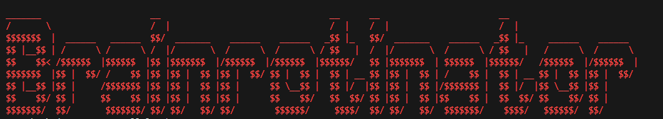

<a id="readme-top"></a>


<!-- PROJECT SHIELDS -->
<!--
*** I'm using markdown "reference style" links for readability.
*** Reference links are enclosed in brackets [ ] instead of parentheses ( ).
*** See the bottom of this document for the declaration of the reference variables
*** for contributors-url, forks-url, etc. This is an optional, concise syntax you may use.
*** https://www.markdownguide.org/basic-syntax/#reference-style-links
-->

[![LinkedIn][linkedin-shield]][linkedin-url]


<!-- PROJECT LOGO -->
<br />
<div align="center">
    
</div>
<div>
  <h3 align="center">Brainrotinator</h3>
    
### Podcast Clip Automation Using AI

  - Edits long form content into clips with subtitles using FFmpeg & moviepy
  - Transcribes audio using Vosk or Whisper Models (your choice)
  - Mutes audio where profanity is detected using CleanVid
  - Uses TinyLlamma LLM to generate titles based on transcription for YouTube and Instagram.
  - Automatically uploads to YouTube, Instagram, and Tiktok based on schedule given in config file using Selenium Firefox.
  - Downloads videos from youtube using given URL using Pytube
  - Thank you Timofei for the inspiration and name of the project.

</div>


<!-- TABLE OF CONTENTS -->
<details>
  <summary>Table of Contents</summary>
  <ol>
    <li>
      <a href="#about-the-project">About The Project</a>
      <ul>
        <li><a href="#video-created-and-uploaded-using-brainrotinator">Video Created and Uploaded Using Brainrotinator</a></li>
      </ul>
    </li>
    <li>
      <a href="#getting-started">Getting Started</a>
      <ul>
        <li><a href="#install-and-run-with-docker">Install and run with Docker</a>
          <ul>
            <li><a href="#prerequisites">Prerequisites</a></li>
            <li><a href="#installation">Installation</a></li>
          </ul>
        </li>
        <li><a href="#install-and-run-without-docker">Install and run without Docker</a>
          <ul>
            <li><a href="#prerequisites-1">Prerequisites</a></li>
            <li><a href="#installation-1">Installation</a></li>
          </ul>
        </li>
      </ul>
    </li>
    <li>
      <a href="#running-the-program">Running the Program</a>
      <ul>
        <li><a href="#uses">Uses</a></li>
        <li><a href="#flags">Flags</a></li>
        <li><a href="#config">Config</a></li>
      </ul>
    </li>
    <li>
      <a href="#things-to-note">Things to Note</a>
    </li>
    <li>
      <a href="#vosk-or-whisper">Vosk or Whisper</a>
      <ul>
        <li><a href="#whisper">Whisper</a></li>
        <li><a href="#vosk">Vosk</a></li>
      </ul>
    </li>
    <li><a href="#license">License</a></li>
    <li><a href="#contact">Contact</a></li>
    <li><a href="#acknowledgments">Acknowledgments</a></li>
  </ol>
</details>


<!-- ABOUT THE PROJECT -->
## About The Project

### Video Created and Uploaded Using Brainrotinator


https://github.com/user-attachments/assets/36b5d927-ecde-4099-b9f5-687d2b0108e5


[Watch the demo on youtube](https://www.youtube.com/shorts/p__GGpKI9-w)

[Original Video](https://www.youtube.com/watch?v=Ue_jnmeBO_I)

I initially made this as a joke. 
I have been editing youtube videos myself for around 10 years now. I wanted to see if I could automate the horrible podcast clips I see on youtube shorts using python.

It was really fun working with AI models to make some cool features for this project


<!-- GETTING STARTED -->
## Getting Started

Due to moviepy, the setup for this program is very difficult. That is why I included a docker file and instructions below to run that. If you are brave you can try to setup this locally without the docker file. I do not recommend it though, as I have lost days debugging random dependencies because of moviepy.

## Install and run with docker

### Prerequisites

  * Docker installed on your machine
  * Python installed on machine
  * around 10gb of VRAM on your machine
  * around 20gb of storage space (for docker image with Vosk and TinyLlama)

### Installation

You can skip steps 3-4 if you are only using the video edit functionality 

1. Clone the repo
2. cd into the repo
3. install Requirements for login
    ```sh
    pip install -r requirementsCookies.txt
    ```
4. Run Login script to get cookies for upload
    ```sh
    python login.py
    ```
    * This is needed since docker has no gui, so selenium will run headless.
    * If cookies are not provided it will prompt you to login, causing the program to crash.
    * The login script must be run on a pc with a gui to provide cookies before running the docker container.
5. Build docker
    ```sh
    Docker build -t brainrotinator .
    ```
6. Run the container with a volume (so all videos are saved between container restarts)
   ```sh
   docker run -v "theRepositoryPathOnYourMachineHere:/app" -it brainrotinator
   ```
7. Start the program
   ```sh
   python main.py
   ```
8. Update config to your preferences.


<p align="right">(<a href="#readme-top">back to top</a>)</p>

## Install and run without docker

### Prerequisites

* Firefox Installed
* Python installed
* around 10gb of VRAM on your machine
* around 4gb for tinyLlama
* around 4gb for vosk (same for whisper if you choose to use it instead of vosk)


### Installation
The steps for installation are very similar to how the DockerFile is setup

1. Clone repository
2. Cd into repository
3. Install requirements
```sh
pip install -r requirements.txt
```

4. Install geckodriver-v0.32.0
   * add geckoDriver to your system path

5. Install ImageMagick

6. Set the following enviorment variables

    * IMAGEMAGICK_BINARY=pathToImageMagick.exe
    * FFMPEG_BINARY=PathToFFMPEG.exe

7. Install FFmpeg
    * add to your system path

8. Start the program
   ```sh
   python main.py
   ```
9. Update config to your preferences.

<p align="right">(<a href="#readme-top">back to top</a>)</p>

## Running the Program

### Uses
Currently the flow of the program with no flags is edit one video in the to_split folder into clips. Then upload according to schedule in the config file until the done_split folder is empty. Then repeats this.
So edit video, upload until nothing else to upload, then edit video.

### Flags

```sh
python main.py -e
```
 Only edits videos.

```sh
python main.py -u
```
Only uploads videos based on the config.json file


### Config

```json
{
  "tags": [
    "chuckle Sandwich",
    "jschlatt",
    "ted nivison",
    "slimecicle",
    "gaming",
    "comedy",
    "tucker",
    "jambo"
  ], #tags for youtube, hashtags for tiktok, and instagram
  "description": "#shorts", #description for youtube, description put before tags for instagram, and tiktok
  "howManyUploads": 1, #how many times to upload before sleeping howManyHoursLongToSleep
  "howManyHoursBetweenSchedule": 0, #if using schedule, how many hours between each video is scheduled [instagram does not support scheduling]
  "howManyMinsBetweenUpload": 5, #how many mins between each upload [plus random value between 0-5 mins]
  "howManyHoursLongToSleep": 23, #sleep x hours between each amount of howManyUploads uploads
  "sleepXMinsBeforeStartingUploader": 0, #sleep x time on start of program before upload
  "chunkDuration": 58, #the length in seconds you want the clip to be
  "uploadToYoutube": true,
  "uploadToInstagram": true,
  "uploadToTiktok": false,
  "blurTopBottomOfClip": true, #False means video will just be cropped to fill whole frame
  "useWhisperForTranscription": false,
  "filterProfanityInSubtitles": false, #if you want the profanity filter to filter out subtitles that will be overlayed in the video
  "firefoxHeadless": true #runs firefox with or without ui
}
```

### Update the config file before running the program. 
* Only one of Vosk or Whisper can be set to true

* Headless must be set to true if running in a docker container (since docker has no gui app abilities)
* howManyHoursBetweenSchedule or Scheduling is only supported by youtube and tiktok. It will not work with instagram


<p align="right">(<a href="#readme-top">back to top</a>)</p>

## Things to note
* When running headless mode (where selenium runs without ui/windowless) if you have not yet logged in, or provided cookies that were saved, the program will crash
* uploadToTiktok flag requires you to follow the instruction from https://github.com/wkaisertexas/tiktok-uploader to setup cookies. The problem is that YOU WILL GET BLOCKED BY CAPTCAS. You can use a service like https://www.sadcaptcha.com/ to solve, but I did not want to use any pay to use api's.

* swears.txt contains a list of swears the program checks for in srt file, and audio. Remove and add words to this list to your liking.
* Due to selenium relying on the layout of a website to not change. The upload functionality will break in the future! You will need to update the elements used in youtube_uploader, and instagram_uploader. This is due to website changes for instagram, youtube, and tiktok may make in the future.
* I WILL NOT BE MAINTAINING THIS REPO, I just wanted to share this project in case if anyone wants to try it. The editor function in this project will for sure hold up to the test of time, but the uploader may break.
## Vosk or whisper
### Whisper

**Pros:**
- Really accurate
- Better profanity filter due to accuracy

**Cons:**
- Subtitles linger/timing is bad
- Late/early profanity mute due to timing

### Vosk

**Pros:**
- Timing is really good
- Timing of muting profanity very good

**Cons:**
- Not very accurate, so words might not get filtered
- A lot of the words are not accurate

### Notes
Maybe adapt whisper to use https://github.com/m-bain/whisperX for better timing

* I used vosk for the example video in readme
* Vosk vs whisper comparison in the demo_and_images folder

<p align="right">(<a href="#readme-top">back to top</a>)</p>

<!-- LICENSE -->
## License

Do not Sell this program. Do not use it for your own cloud service you are selling like [this](https://www.opus.pro/).
Other than that do what you like with it.


<!-- CONTACT -->
## Contact

Luke Sorvik - lukesorv@uw.edu


<!-- ACKNOWLEDGMENTS -->
## Acknowledgments

Thank you to the following projects for making this possible.

* [Vosk](https://alphacephei.com/vosk/)
* [Whisper](https://github.com/openai/whisper)
* [TinyLlama](https://huggingface.co/TinyLlama)
* [Text Profanity Filter](https://github.com/ben174/profanity)
* [CleanVid (mute profanity in audio)](https://github.com/mmguero/cleanvid)
* [FFmpeg](https://ffmpeg.org/)
* [Moviepy](https://pypi.org/project/moviepy/)
* [Youtube selenium uploader (also what I used to make the instagram uploader)](https://github.com/linouk23/youtube_uploader_selenium)
* [PytubeFix for downloading youtube videos](https://github.com/JuanBindez/pytubefix)
* [TiktokUploader](https://github.com/wkaisertexas/tiktok-uploader)
* [readme Template](https://github.com/othneildrew/Best-README-Template/blob/main/README.md)

<p align="right">(<a href="#readme-top">back to top</a>)</p>


<!-- MARKDOWN LINKS & IMAGES -->
<!-- https://www.markdownguide.org/basic-syntax/#reference-style-links -->
[contributors-shield]: https://img.shields.io/github/contributors/othneildrew/Best-README-Template.svg?style=for-the-badge
[contributors-url]: https://github.com/othneildrew/Best-README-Template/graphs/contributors
[forks-shield]: https://img.shields.io/github/forks/othneildrew/Best-README-Template.svg?style=for-the-badge
[forks-url]: https://github.com/othneildrew/Best-README-Template/network/members
[stars-shield]: https://img.shields.io/github/stars/othneildrew/Best-README-Template.svg?style=for-the-badge
[stars-url]: https://github.com/othneildrew/Best-README-Template/stargazers
[issues-shield]: https://img.shields.io/github/issues/othneildrew/Best-README-Template.svg?style=for-the-badge
[issues-url]: https://github.com/othneildrew/Best-README-Template/issues
[license-shield]: https://img.shields.io/github/license/othneildrew/Best-README-Template.svg?style=for-the-badge
[license-url]: https://github.com/othneildrew/Best-README-Template/blob/master/LICENSE.txt
[linkedin-shield]: https://img.shields.io/badge/-LinkedIn-black.svg?style=for-the-badge&logo=linkedin&colorB=555
[linkedin-url]: https://www.linkedin.com/in/luke-sorvik/
[product-screenshot]: images/screenshot.png
[Next.js]: https://img.shields.io/badge/next.js-000000?style=for-the-badge&logo=nextdotjs&logoColor=white
[Next-url]: https://nextjs.org/
[React.js]: https://img.shields.io/badge/React-20232A?style=for-the-badge&logo=react&logoColor=61DAFB
[React-url]: https://reactjs.org/
[Vue.js]: https://img.shields.io/badge/Vue.js-35495E?style=for-the-badge&logo=vuedotjs&logoColor=4FC08D
[Vue-url]: https://vuejs.org/
[Angular.io]: https://img.shields.io/badge/Angular-DD0031?style=for-the-badge&logo=angular&logoColor=white
[Angular-url]: https://angular.io/
[Svelte.dev]: https://img.shields.io/badge/Svelte-4A4A55?style=for-the-badge&logo=svelte&logoColor=FF3E00
[Svelte-url]: https://svelte.dev/
[Laravel.com]: https://img.shields.io/badge/Laravel-FF2D20?style=for-the-badge&logo=laravel&logoColor=white
[Laravel-url]: https://laravel.com
[Bootstrap.com]: https://img.shields.io/badge/Bootstrap-563D7C?style=for-the-badge&logo=bootstrap&logoColor=white
[Bootstrap-url]: https://getbootstrap.com
[JQuery.com]: https://img.shields.io/badge/jQuery-0769AD?style=for-the-badge&logo=jquery&logoColor=white
[JQuery-url]: https://jquery.com 
