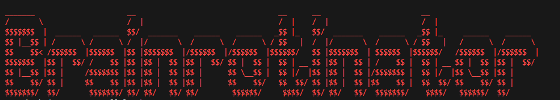
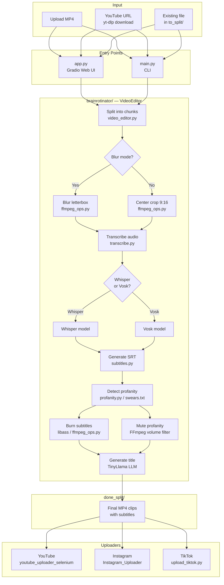

<a id="readme-top"></a>


<!-- PROJECT SHIELDS -->
<!--
*** I'm using markdown "reference style" links for readability.
*** Reference links are enclosed in brackets [ ] instead of parentheses ( ).
*** See the bottom of this document for the declaration of the reference variables
*** for contributors-url, forks-url, etc. This is an optional, concise syntax you may use.
*** https://www.markdownguide.org/basic-syntax/#reference-style-links
-->

[![LinkedIn][linkedin-shield]][linkedin-url]


<!-- PROJECT LOGO -->
<br />
<div align="center">
    
</div>
<div>
  <h3 align="center">Brainrotinator</h3>
    
### Podcast Clip Automation Using AI

  - Edits long form content into clips with subtitles using FFmpeg (libass for burn-in)
  - Web UI built with Gradio for editing — CLI still works for headless / cron use
  - Transcribes audio using Vosk or Whisper Models (your choice)
  - Mutes audio where profanity is detected using FFmpeg's `volume` filter driven by SRT timestamps
  - Uses TinyLlamma LLM to generate titles based on transcription for YouTube and Instagram.
  - Automatically uploads to YouTube, Instagram, and Tiktok based on schedule given in config file using Selenium Firefox.
  - Downloads videos from youtube using given URL using Pytube
  - Thank you Timofei for the inspiration and name of the project.

</div>


<!-- TABLE OF CONTENTS -->
<details>
  <summary>Table of Contents</summary>
  <ol>
    <li><a href="#about-the-project">About The Project</a></li>
    <li><a href="#architecture">Architecture</a></li>
    <li><a href="#getting-started">Getting Started</a>
      <ul>
        <li><a href="#install-without-docker">Install without Docker</a></li>
        <li><a href="#install-with-docker">Install with Docker</a></li>
      </ul>
    </li>
    <li><a href="#running-the-program">Running the Program</a>
      <ul>
        <li><a href="#gradio-ui">Gradio UI</a></li>
        <li><a href="#cli">CLI</a></li>
        <li><a href="#config">Config</a></li>
      </ul>
    </li>
    <li><a href="#things-to-note">Things to note</a></li>
    <li><a href="#vosk-or-whisper">Vosk or Whisper</a></li>
    <li><a href="#license">License</a></li>
    <li><a href="#contact">Contact</a></li>
    <li><a href="#acknowledgments">Acknowledgments</a></li>
  </ol>
</details>


<!-- ABOUT THE PROJECT -->
## About The Project

### Video Created and Uploaded Using Brainrotinator


https://github.com/user-attachments/assets/36b5d927-ecde-4099-b9f5-687d2b0108e5


[Watch the demo on youtube](https://www.youtube.com/shorts/p__GGpKI9-w)

[Original Video](https://www.youtube.com/watch?v=Ue_jnmeBO_I)

I initially made this as a joke. 
I have been editing youtube videos myself for around 10 years now. I wanted to see if I could automate the horrible podcast clips I see on youtube shorts using python.

It was really fun working with AI models to make some cool features for this project


## New Gradio Layout:


<!-- ARCHITECTURE -->
## Architecture

The editor is **FFmpeg-only** as of the v2 rewrite. moviepy, ImageMagick, and cleanvid have all been removed. Setup is dramatically simpler — `pip install -r requirements.txt` and a working `ffmpeg` binary is enough to edit videos.

### Application Flow


```mermaid
flowchart TD
    subgraph Input
        A1[Upload MP4] 
        A2[YouTube URL\nyt-dlp download]
        A3[Existing file\nin to_split/]
    end

    subgraph UI["Entry Points"]
        B1[app.py\nGradio Web UI]
        B2[main.py\nCLI]
    end

    subgraph Editor["brainrotinator/ — VideoEditor"]
        C1[Split into chunks\nvideo_editor.py]
        C2{Blur mode?}
        C3[Blur letterbox\nffmpeg_ops.py]
        C4[Center crop 9:16\nffmpeg_ops.py]
        C5[Transcribe audio\ntranscribe.py]
        C6{Whisper\nor Vosk?}
        C7[Whisper model]
        C8[Vosk model]
        C9[Generate SRT\nsubtitles.py]
        C10[Detect profanity\nprofanity.py / swears.txt]
        C11[Burn subtitles\nlibass / ffmpeg_ops.py]
        C12[Mute profanity\nFFmpeg volume filter]
        C13[Generate title\nTinyLlama LLM]
    end

    subgraph Output["done_split/"]
        D1[Final MP4 clips\nwith subtitles]
    end

    subgraph Uploaders
        E1[YouTube\nyoutube_uploader_selenium]
        E2[Instagram\nInstagram_Uploader]
        E3[TikTok\nupload_tiktok.py]
    end

    A1 & A2 & A3 --> B1
    A1 & A2 & A3 --> B2
    B1 & B2 --> C1
    C1 --> C2
    C2 -->|Yes| C3
    C2 -->|No| C4
    C3 & C4 --> C5
    C5 --> C6
    C6 -->|Whisper| C7
    C6 -->|Vosk| C8
    C7 & C8 --> C9
    C9 --> C10
    C10 --> C11
    C10 --> C12
    C11 & C12 --> C13
    C13 --> D1
    D1 --> E1 & E2 & E3
```

### Repo Layout

```text
brainrotinator/                # Editor package — pure FFmpeg
  ffmpeg_ops.py                # Cut, crop, blur, burn-in, mute wrappers
  subtitles.py                 # SRT → styled ASS, profanity → mute-range list
  transcribe.py                # Vosk / Whisper / TinyLlama (lazy, resumable)
  video_editor.py              # Per-chunk orchestration
  profanity.py                 # Text-profanity censor
uploaders/                     # Selenium-based uploaders
  login.py, uploader_selenium.py, upload_tiktok.py
  Instagram_Uploader/, youtube_uploader_selenium/
downloader/                    # yt-dlp downloader module
  downloadVid.py, combineAudioVideo.py
assets/                        # Static files
  fonts/, swears.txt, title.txt
to_split/, done_split/, subtitles/   # Runtime media directories
models/                        # Persistent AI models storage (Vosk/TinyLllama/Whisper)
app.py                         # Gradio Web UI entrypoint
main.py                        # CLI entrypoint
config.py / config.json        # Pydantic configuration model
Dockerfile / docker-compose.yml # Containerization setup
```

<p align="right">(<a href="#readme-top">back to top</a>)</p>

<!-- GETTING STARTED -->
## Getting Started

Editing requires only Python, FFmpeg (with libass), and ~8 GB of disk for models on first run. The selenium uploaders additionally need Firefox + geckodriver and per-platform cookies.

### Install with Docker

The best way to run Brainrotinator with Docker is using **Docker Compose**. This automatically handles mounting the `to_split`, `done_split`, and `models` directories so your files and AI models are saved locally on your machine, working seamlessly across Windows, Mac, and Linux without complex path variables.

1. Ensure your `config.json` points the AI models to the synced `models` folder:
   ```json
   "voskModelDir": "models",
   "tinyLlamaDir": "models"
   ```

2. Build and start the container in the background. (Use `--build` the first time you run this, or after pulling in new code updates):
   ```sh
   docker compose up -d --build
   ```
   *Note: On subsequent runs, you can just use `docker compose up -d` to start the container instantly without docker checking for build updates.*

Then open http://localhost:7860.

To view logs or access the container shell:
* **Logs:** `docker compose logs -f`
* **Shell:** `docker compose exec brainrotinator bash`

If you'll use the uploader, run `python login.py` **on your host** first (it needs a GUI) so cookies are present in the mounted volume before the container starts.

#### Save output locally without Gradio

You can also run the CLI editor directly via Docker Compose (bypassing the web UI). Finished clips land in `done_split/` on your host machine, so no browser download is needed:

```sh
docker compose run --rm brainrotinator python main.py -e
```

Drop your source mp4s into `to_split/` before running.

<p align="right">(<a href="#readme-top">back to top</a>)</p>


### Install without Docker


**Prerequisites**

* Python 3.10+
* FFmpeg with libass (`ffmpeg -filters | grep " ass "` should list it; most distro packages and the official Windows builds include it)
* ~10 GB VRAM if you'll use Whisper; CPU is fine for Vosk
* ~4 GB for the TinyLlama model, ~4 GB for the Vosk model (downloaded automatically on first use)
* Firefox + geckodriver — only if you'll use the uploader

**Steps**

1. Clone the repo and `cd` in.
2. Install Python deps:
   ```sh
   pip install -r requirements.txt
   ```
3. Make sure `ffmpeg` is on your `PATH`. No `IMAGEMAGICK_BINARY` / `FFMPEG_BINARY` env vars are needed anymore.
4. *(Uploader only)* install geckodriver v0.32.0 and put it on your `PATH`, then run `python login.py` once on a machine with a GUI to capture cookies.
5. Launch:
   * Gradio UI: `python app.py` → http://localhost:7860
   * Or CLI: `python main.py` (see [CLI](#cli) below)


## Running the Program

### Gradio UI

```sh
python app.py
```

Tabs:

* **Edit** — upload an mp4 or paste a YouTube URL, set chunk length / blur / Vosk-vs-Whisper / profanity filter, watch logs stream as the splitter runs.
* **Library** — list everything in `done_split/`. **Click a filename to download it** to your computer. Delete clips you don't want.
* **Settings** — edit `config.json` in-browser, validated against the pydantic schema before save.

### CLI

```sh
python main.py        # default loop: edit one video → upload from done_split → repeat
python main.py -e     # edit only (consume to_split/, write to done_split/)
python main.py -u     # upload only (consume done_split/ on the schedule in config.json)
```

When the editor runs out of videos in `to_split/`, the CLI prompts for a YouTube URL and downloads it via `yt-dlp`.

### Config

`config.json` is now validated by `config.Config` (`config.py`). Defaults are filled in for any missing keys.

```json
{
    "tags": ["chuckle Sandwich", "jschlatt", "ted nivison", "slimecicle", "gaming", "comedy"],
    "description": "#shorts",

    "howManyUploads": 1,
    "howManyHoursBetweenSchedule": 0,
    "howManyMinsBetweenUpload": 5,
    "howManyHoursLongToSleep": 23,
    "sleepXMinsBeforeStartingUploader": 0,

    "chunkDuration": 58,
    "blurTopBottomOfClip": true,
    "useWhisperForTranscription": false,
    "filterProfanityInSubtitles": false,

    "uploadToYoutube": true,
    "uploadToInstagram": true,
    "uploadToTiktok": false,
    "firefoxHeadless": true,

    "voskModelDir": "",
    "tinyLlamaDir": ""
}
```

| Key | Meaning |
|---|---|
| `tags` | YouTube tags; also used as #hashtags appended to the IG/TikTok caption |
| `description` | YouTube description; prepended before tags for IG/TikTok |
| `howManyUploads` | Uploads per cycle before sleeping `howManyHoursLongToSleep` |
| `howManyHoursBetweenSchedule` | Hours between each scheduled upload (YouTube/TikTok only — IG ignores) |
| `howManyMinsBetweenUpload` | Base delay between uploads, plus a 0–5 min jitter |
| `chunkDuration` | Clip length in seconds |
| `blurTopBottomOfClip` | `true` = blurred letterbox; `false` = center-crop to 9:16 |
| `useWhisperForTranscription` | `true` = Whisper, `false` = Vosk |
| `filterProfanityInSubtitles` | Censor swears in burned-in subtitles (audio is muted regardless) |
| `firefoxHeadless` | Must be `true` inside Docker (no display) |
| `voskModelDir`, `tinyLlamaDir` | Where to cache models. Empty = current working directory |

<p align="right">(<a href="#readme-top">back to top</a>)</p>

## Things to note

* **Editor vs uploader**: the editor is FFmpeg-only and should keep working indefinitely. The selenium uploaders depend on YouTube/IG/TikTok DOM layout and **will break** when those sites change. I am not maintaining them.
* **`swears.txt`** is the source of truth for what gets muted. Add or remove words to taste. Matching is word-bounded so `ass` won't match `class`.
* **TikTok uploads** require cookies from https://github.com/wkaisertexas/tiktok-uploader — and you will hit captchas. A paid solver like sadcaptcha can fix it; this repo doesn't include one.
* **Headless selenium**: cookies must already exist or the upload will crash. Run `login.py` on a machine with a GUI first.
* **Models** download lazily on first transcription. Vosk shows a `tqdm` progress bar; TinyLlama uses `huggingface_hub.snapshot_download` (resumable).
* **libass fonts**: the burn-in filter is invoked with `fontsdir=fonts/`, so any `.ttf` you drop in `fonts/` is available. Default is `Bangers.ttf`.
## Vosk or whisper
### Whisper

**Pros:**
- Really accurate
- Better profanity filter due to accuracy

**Cons:**
- Subtitles linger/timing is bad
- Late/early profanity mute due to timing

### Vosk

**Pros:**
- Timing is really good
- Timing of muting profanity very good

**Cons:**
- Not very accurate, so words might not get filtered
- A lot of the words are not accurate

### Notes
Maybe adapt whisper to use https://github.com/m-bain/whisperX for better timing

* I used vosk for the example video in readme
* Vosk vs whisper comparison in the demo_and_images folder

<p align="right">(<a href="#readme-top">back to top</a>)</p>

<!-- LICENSE -->
## License

Do not Sell this program. Do not use it for your own cloud service you are selling like [this](https://www.opus.pro/).
Other than that do what you like with it.


<!-- ACKNOWLEDGMENTS -->
## Acknowledgments

Thank you to the following projects for making this possible.

* [Vosk](https://alphacephei.com/vosk/)
* [Whisper](https://github.com/openai/whisper)
* [TinyLlama](https://huggingface.co/TinyLlama)
* [Text Profanity Filter](https://github.com/ben174/profanity)
* [CleanVid (mute profanity in audio)](https://github.com/mmguero/cleanvid)
* [FFmpeg](https://ffmpeg.org/) + [libass](https://github.com/libass/libass)
* [pysubs2](https://github.com/tkarabela/pysubs2) (SRT → ASS conversion)
* [Gradio](https://www.gradio.app/)
* [Youtube selenium uploader (also what I used to make the instagram uploader)](https://github.com/linouk23/youtube_uploader_selenium)
* [yt-dlp for downloading youtube videos](https://github.com/ytdl-org/youtube-dl)
* [TiktokUploader](https://github.com/wkaisertexas/tiktok-uploader)
* [readme Template](https://github.com/othneildrew/Best-README-Template/blob/main/README.md)


### TODO
- Add support for different models (current ones are outdated)
- Change preview of subtitles, maybe run subtitles through llm to get emojis or custom colors per line
- Color param for text
- CV to focus crop around face/person talking

<p align="right">(<a href="#readme-top">back to top</a>)</p>


<!-- MARKDOWN LINKS & IMAGES -->
<!-- https://www.markdownguide.org/basic-syntax/#reference-style-links -->
[contributors-shield]: https://img.shields.io/github/contributors/othneildrew/Best-README-Template.svg?style=for-the-badge
[contributors-url]: https://github.com/othneildrew/Best-README-Template/graphs/contributors
[forks-shield]: https://img.shields.io/github/forks/othneildrew/Best-README-Template.svg?style=for-the-badge
[forks-url]: https://github.com/othneildrew/Best-README-Template/network/members
[stars-shield]: https://img.shields.io/github/stars/othneildrew/Best-README-Template.svg?style=for-the-badge
[stars-url]: https://github.com/othneildrew/Best-README-Template/stargazers
[issues-shield]: https://img.shields.io/github/issues/othneildrew/Best-README-Template.svg?style=for-the-badge
[issues-url]: https://github.com/othneildrew/Best-README-Template/issues
[license-shield]: https://img.shields.io/github/license/othneildrew/Best-README-Template.svg?style=for-the-badge
[license-url]: https://github.com/othneildrew/Best-README-Template/blob/master/LICENSE.txt
[linkedin-shield]: https://img.shields.io/badge/-LinkedIn-black.svg?style=for-the-badge&logo=linkedin&colorB=555
[linkedin-url]: https://www.linkedin.com/in/luke-sorvik/
[product-screenshot]: images/screenshot.png
[Next.js]: https://img.shields.io/badge/next.js-000000?style=for-the-badge&logo=nextdotjs&logoColor=white
[Next-url]: https://nextjs.org/
[React.js]: https://img.shields.io/badge/React-20232A?style=for-the-badge&logo=react&logoColor=61DAFB
[React-url]: https://reactjs.org/
[Vue.js]: https://img.shields.io/badge/Vue.js-35495E?style=for-the-badge&logo=vuedotjs&logoColor=4FC08D
[Vue-url]: https://vuejs.org/
[Angular.io]: https://img.shields.io/badge/Angular-DD0031?style=for-the-badge&logo=angular&logoColor=white
[Angular-url]: https://angular.io/
[Svelte.dev]: https://img.shields.io/badge/Svelte-4A4A55?style=for-the-badge&logo=svelte&logoColor=FF3E00
[Svelte-url]: https://svelte.dev/
[Laravel.com]: https://img.shields.io/badge/Laravel-FF2D20?style=for-the-badge&logo=laravel&logoColor=white
[Laravel-url]: https://laravel.com
[Bootstrap.com]: https://img.shields.io/badge/Bootstrap-563D7C?style=for-the-badge&logo=bootstrap&logoColor=white
[Bootstrap-url]: https://getbootstrap.com
[JQuery.com]: https://img.shields.io/badge/jQuery-0769AD?style=for-the-badge&logo=jquery&logoColor=white
[JQuery-url]: https://jquery.com 
